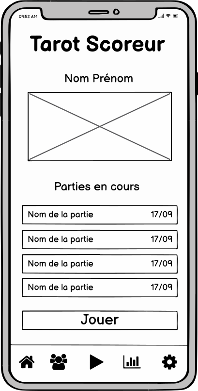
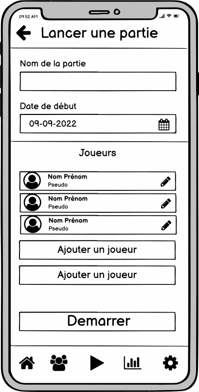
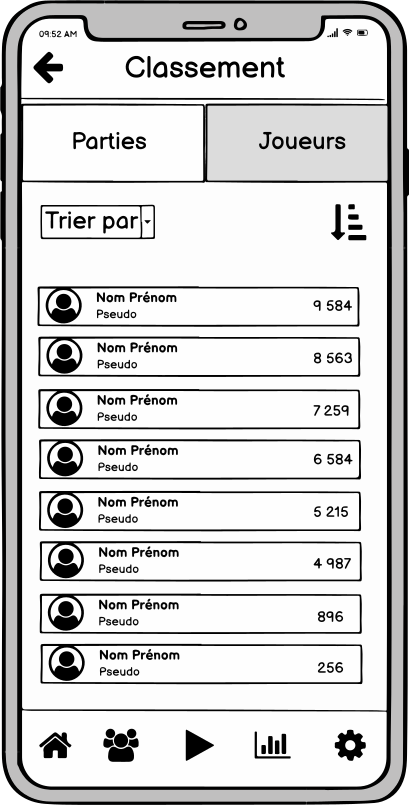
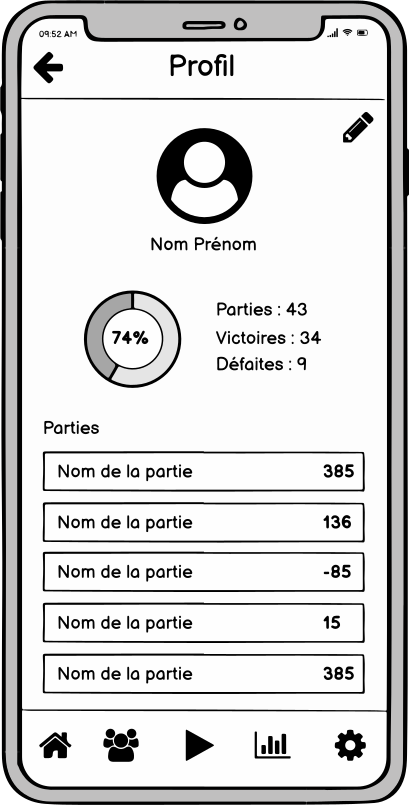

# Tarot Scoreur

[](https://codefirst.iut.uca.fr/jordan.artzet/SFJJ-TarotScoreur)
[](https://codefirst.iut.uca.fr/sonar/dashboard?id=SFJJ-TarotScoreur)
[](https://codefirst.iut.uca.fr/sonar/dashboard?id=SFJJ-TarotScoreur)
[](https://codefirst.iut.uca.fr/sonar/dashboard?id=SFJJ-TarotScoreur)
[](https://codefirst.iut.uca.fr/sonar/dashboard?id=SFJJ-TarotScoreur)
[](https://codefirst.iut.uca.fr/sonar/dashboard?id=SFJJ-TarotScoreur)
[](https://codefirst.iut.uca.fr/sonar/dashboard?id=SFJJ-TarotScoreur)
[](https://codefirst.iut.uca.fr/sonar/dashboard?id=SFJJ-TarotScoreur)
[](https://codefirst.iut.uca.fr/sonar/dashboard?id=SFJJ-TarotScoreur)
[](https://codefirst.iut.uca.fr/sonar/dashboard?id=SFJJ-TarotScoreur)
[](https://codefirst.iut.uca.fr/sonar/dashboard?id=SFJJ-TarotScoreur)


<!-- Présentation -->
\
The Tarot Scoreur application allows during your tarot games to automatically count the points of all the players in the game. With this application you can play online with your friend or play locally at your home !

## Installation

### Launch console app

1. Move into `Sources/TarotDb`
2. Create migration with the following command
   ```
   dotnet ef migrations add myFirstMigration
   ```
3. Move into `Sources/Tests/FT_TarotDb`
   ```
   cd ..\Tests\FT_TarotDB\
   ```
4. Create or update database with the following command
   ```
   dotnet ef database update --project ..\..\TarotDB\
   ```
5. Run project `FT_TarobDb` with the following command
   ```
   dotnet run
   ```

## **Examples**

<!-- Mettre des images de l'application par le future -->






Here is some examples of what you can do with the application.  
- You can see who you are and your current games 
- You can start or create a new game.
- You can add a new hand to your game.
- You can see the ranking of all the players.
- You can see your profile.

For more examples, please refer to the [Wiki](https://codefirst.iut.uca.fr/git/jordan.artzet/SFJJ-TarotScoreur/wiki/Tarot-Scoreur)


## Features

<!-- Qu'est ce que l'on peut faire avec l'application
     Présentation de toutes les fontionnalités -->

### Online mode

This mode allow you to play online and share your scores and achievements of all the game you play.

### Local mode

This mode allow you to play at your home and add your friends on your phone. Enjoy playing your tarot games with your friends at home !

## Usage

To learn how to use our application you can read the [user manual](https://codefirst.iut.uca.fr/git/jordan.artzet/SFJJ-TarotScoreur/wiki/Tarot-Scoreur-en) on the wiki.
 

## Questions

For questions and support ask [here](#).

## Contributors

| Name            | Role                                                                            |
|-----------------|---------------------------------------------------------------------------------|
| Samuel Sirven   | Best manager of all times                                                       |
| Florent Marques | Developer who develop the player, user and ranking features (like the football) |
| Julien Themes   | Developer who develop the management of the games                               |
| Jordan Artzet   | Best developer of all times                                                     |


